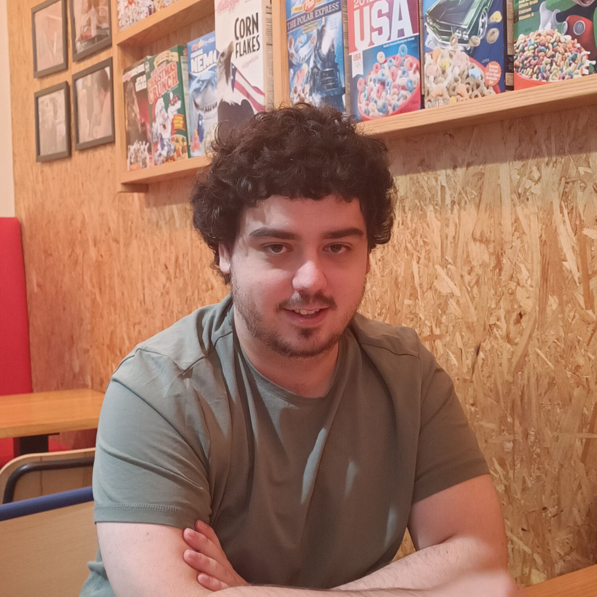

    <h1>David Arnaiz</h1>
    
Embedded Software Engineer

  <a href="mailto:electronplant@gmail.com" target="_blank" rel="noopener noreferrer" title="Email">
    :octicons-mail-16:
  </a>
  <a href="https://github.com/ElectronPlant" target="_blank" rel="noopener noreferrer" title="Github">
    :fontawesome-brands-github:
  </a>
  <a href="https://www.linkedin.com/in/david-arnaiz-mart%C3%ADnez" target="_blank" rel="noopener noreferrer" title="LinkedIn">
    :fontawesome-brands-linkedin:
  </a>
  <a href="https://scholar.google.com/citations?user=32m35KwAAAAJ&hl=en" target="_blank" rel="noopener noreferrer" title="Google Scholar">
    :fontawesome-brands-google-scholar:
  </a>
  <a href="assets/documents/DavidArnaiz_CV_2025_05.pdf" target="_blank" rel="noopener noreferrer" title="Download PDF">
    :fontawesome-solid-file-pdf:
  </a>

    
Keywords

    
Firmware Engineer

    
Embedded Systems

    
Electronics Engineer

    
RTOS Application Dev.

---
## :material-eye: About me

Who Am I?

I'm an experienced embedded systems engineer with 6+ years of working experience and a PhD in dynamic energy management of wireless sensor nodes.
I'm an about the design and development of intelligent embedded systems, and have a proven track record with the complete design process from the schematic design to the firmware application.

Profile

* Embedded system engineer with 6+ years of experience working as a part of international and multidisciplinary teams.
* Proven track record with:
    * Designing embedded software architectures.
    * C drivers and Real-time FreeRTOS applications.
    * Mixed-signal electronic schematic design.
* Great communication, coordination and interpersonal skills.
* Focused on continuous improvement and innovation, delivering contributions to significant projects.

---
## :material-lightbulb: Skills

Programming Languages

    
Proficent: 

    
C

    
Fluent: 

    
Rust

    
C++

    
Python

    
Interm: 

    
Latex

    
Assembly

    
Shell

    
Basic: 

    
VHDL

Miscellaneous

* __Serial protocols:__ I2C, SPI, UART.
* __Development tools:__ VS Code, Eclipse, KiCad, Cadence, Git, Unit Testing.
* __Measurement tools:__ oscilloscope, logic analyzer, power monitor, GDB.
* __Languages:__ Spanish (native), English (B2).

---
## :fontawesome-solid-briefcase: Work Experience

    Embedded Software Engineer
    [Dec. 2019 - Present]

    WorldSensing
     :fontawesome-solid-location-dot: Barcelona, Spain

* Defined and developed the FW architecture for the vibration node featuring a configurable data processing pipeline, and integrating different firmware modules and RTOS tasks.
* Developed multiple sensor drivers, FW modules, and complete features for LoRa-based wireless sensor nodes.

    Electronic Designer
    [Oct 2018 - Dec 2019]

    Rolls-Royce - Control Systems
     :fontawesome-solid-location-dot: Birmingham, UK

* Participated in the design of the Engine Monitoring Unit.
* Designed lightning strike protection circuits for aircraft electronics.
* Wrote hardware design documents, technical documentation and guidelines.
* Hands-on lab testing.

    R&D Electronic Engineer
    [Sept. 2016 - Sept. 2018]

    HP - Large Format Printing
     :fontawesome-solid-location-dot: Barcelona, Spain

* Managed electronic schematic designs for printer mechatronics and interface.
* PCBs based on STM32 microcontrollers and featuring SPI, I2C and UART serial interfaces, PWM outputs custom power supply sources.
* Developed custom HW and FW prototypes for inductive, optic sensing.
* Handled printer self-diagnostics at the PCB level.

---
## :fontawesome-solid-graduation-cap: Education

    Ph.D. in Electronic Engineering
    [Sept. 2019 - July. 2024]

    Polytechnic University of Cataluña (UPC)
    :fontawesome-solid-location-dot: Barcelona, Spain

* Grade of excellence.

    M.Sc. in Electronic Engineering
    [Sept. 2016 - Sept. 2018]

    Polytechnic University of Cataluña (UPC)
    :fontawesome-solid-location-dot: Barcelona, Spain

* GPA of 3.752 (out of 4).

    B.Sc. in Electronic Engineering
    [Sept. 2012 - Sept. 2016]

    University of Granada (UGR)
    :fontawesome-solid-location-dot: Granada, Spain

* GPA of 3.491 (out of 4).

