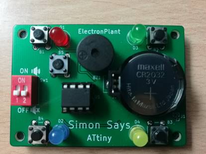

# Projects

My projects can be found on my [github page](https://github.com/ElectronPlant).

Here is a quick overview:

* [__Self-Aware_Sensor_Node_Architecture__](https://github.com/ElectronPlant/Self-Aware_Sensor_Node_Architecture) written in C as a support for my PhD work. This is a basic implementation of the agent-based architecture for the development of wireless sensor nodes.
* [__File manager for CLI applications__](https://github.com/ElectronPlant/file_manager) written in Rust as a support for another personal project I made while learning Rust. This is a simple program to help CLI applications load a given file or save a file. With some helpful features to list all the files in the current directory, save files sequentially for files revisions, etc.
* [__ESP_Project_Template__](https://github.com/ElectronPlant/esp-project-template) is a template repository for ESP32 projects using IDF and FreeRTOS and MkDocs documentation. This project showcases a simple FreeRTOS application.
* [__Simon Says ATtiny__](https://github.com/ElectronPlant/Simon_says_ATtiny) is the implementation of the Simon Says game with a simple ATtiny45/85 IC. This project contains the PCB and the firmware developed in the Arduino platform.
* [__STM32 drivers__](https://github.com/ElectronPlant/STM32_Drivers) these are some C++ drivers for the MPU-6050 I2C sensors and serial print, written in C++.
* [__MPU-6050 Arduino driver__](https://github.com/ElectronPlant/MPU-6050_Arduino_Library) C++ Arduino driver for the MP6050 I2C sensor.
* [__VSLAM Raspberry Pi__](https://github.com/ElectronPlant/Raspberry_Pi_3B_VSLAM) Python implementation of the VSLAM algorithm and robot control software for my B.Sc final project.

<figure markdown="span">
  { width="300" }
  
Complete assembly of the ATtiny Simon Says game

</figure>
