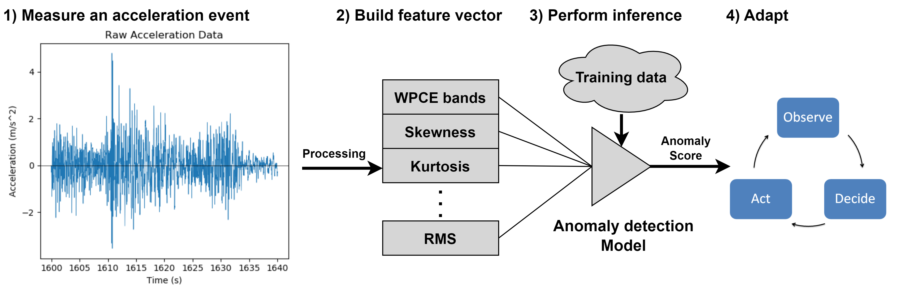

# Publications

This is a hub page linking to my research publications along with a brief summary for each of them. For more updated information checkout my [google scholar's](https://scholar.google.com/citations?user=32m35KwAAAAJ&hl=en) profile.

## Conference Poceddings

    <a target="_blank" rel="noopener noreferrer" href="https://doi.org/10.1109/DCIS53048.2021.9666191" title="C.I">
        Data Relevance-Aware Dynamic Sensing Technique with Battery Lifetime Guarantee for Wireless Sensor Nodes
    </a>

  <a class="publication-link" target="_blank" rel="noopener noreferrer" href="https://doi.org/10.1109/DCIS53048.2021.9666191" title="C.I">
    [C.I]
    D. Arnaiz, F. Moll, E. Alarcón, and X. Vilajosana, “Data Relevance-Aware Dynamic Sensing Technique with Battery Lifetime Guarantee for Wireless Sensor Nodes,” in <i>2021 XXXVI Conference on Design of Circuits and Integrated Systems (DCIS)</i>, pp. 1–6, IEEE, 2021.
  </a>

__Summary:__
This work proposes a lightweight monitoring method for wireless sensor nodes that dynamically adjusts the monitoring efforts based on the perceived temporal correlation of the monitored data, and complies with guarantees of operation in the form of a target battery lifetime. The proposed monitoring method was able to outperform the equivalent naive monitoring methods of equivalent battery life by reducing the \ac{mse} of the reconstructed signal by 42%. The monitoring method proposed in this publication manages two competing goals, maximizing the monitoring accuracy (through the relevance-aware behavior), and achieving the target battery lifetime (through the energy-aware behavior). Furthermore, it was shown to be able to comply with the battery lifetime target.

    <a target="_blank" rel="noopener noreferrer" href="https://doi.org/10.1007/978-3-031-46846-9_21" title="C.II">
        Relating Context and Self Awareness in the Internet of Things
    </a>

  <a class="publication-link" target="_blank" rel="noopener noreferrer" href="https://doi.org/10.1007/978-3-031-46846-9_21" title="C.II">
    [C.II]
    D. Arnaiz, M. Vila, E. Alarcón, F. Moll, M. Sancho, and E. Teniente. "Relating Context and Self Awareness in the Internet of Things." In <i>International Conference on Cooperative Information Systems (COOPIS)</i>, pp. 384-402. Cham: Springer Nature Switzerland, 2023.
  </a>

__Summary:__
Self-aware sensor nodes need to be integrated into a wider IoT network interacting with fog and cloud servers. While self-awareness has started gaining prominence in the field of wireless sensor nodes, a similar concept, i.e. context awareness, has gained more prominence in managing the infrastructure at the higher hierarchical levels of the network. {[C.II]} explores the similarities and differences between both approaches, proposing a reference architecture combining both approaches and taking into consideration the differences in response time and resource availability across the IoT hierarchy to improve upon existing approaches.

## Journal Publications

    <a target="_blank" rel="noopener noreferrer" href="https://doi.org/10.1016/j.vlsi.2023.102097" title="C.III">
        Energy and Relevance-aware Adaptive Monitoring Method for Wireless Sensor Nodes with Hard Energy Constraints
    </a>

  <a class="publication-link" target="_blank" rel="noopener noreferrer" href="https://doi.org/10.1016/j.vlsi.2023.102097" title="C.III">
    [C.III]
    D. Arnaiz, F. Moll, E. Alarcón, and X. Vilajosana, “Energy and relevance-aware adaptive monitoring method for wireless sensor nodes with hard energy constraints,” Integration. The VLSI journal, vol. 94, no. article 102097, 2024.
  </a>

__Summary:__
The work from [C.I] was only able to adjust the monitoring period of the sensor node. Improving the proposed monitoring method would require adding the availability of adjusting multiple parameters at the same time. This work, extends [C.I] by allowing the node to adjust the monitoring period of the node and the error threshold in a dual predictor scheme. The proposed monitoring method was able to reduce the \ac{mse} of the reconstructed signal by up to 19\/\% with regards to the same monitoring method which only considers the battery life for the adaptive behavior, and by up to 16% compared with the other method with only one control parameter.

    <a target="_blank" rel="noopener noreferrer" href="https://doi.org/10.1109/ACCESS.2023.3306958" title="C.IV">
        On Anomaly-Aware Structural Health Monitoring at the Extreme Edge
    </a>

  <a class="publication-link" target="_blank" rel="noopener noreferrer" href="https://doi.org/10.1109/ACCESS.2023.3306958" title="C.IV">
    [C.IV]
    D. Arnaiz, E. Alarcón, F. Moll, and X. Vilajosana, “On anomaly-aware structural health monitoring at the extreme edge,” IEEE Access, 2023.
  </a>

__Summary:__
One of the biggest challenges for implementing self-awareness for SHM applications is the complexity of modeling the monitored structure at the sensor node level. {[C.IV]} proposes the use of lightweight anomaly detection models executed directly by the sensor to compute the anomaly score of the monitoring data, which can then be used by the self-awareness module to guide the adaptive behavior of the sensor node. The proposed anomaly-aware monitoring method has been shown to be able to identify severe and light damages on the structure and was showcased in the context of a more complete self-aware application.

<figure markdown="span">
  { width="800" }
  
Block diagram of the anomaly detection algorithm from [C.IV]

</figure>

## Datasets

    <a target="_blank" rel="noopener noreferrer" href="http://dx.doi.org/10.17632/9k5763jp8j.1" title="C.V">
        Raw Interior Temperature Time Series
    </a>

  <a class="publication-link" target="_blank" rel="noopener noreferrer" href="http://dx.doi.org/10.17632/9k5763jp8j.1" title="C.V">
    [C.V]
    D. Arnaiz, E. Alarcón, F. Moll, and X. Vilajosana, “Raw Interior Temperature Time Series,” Mendeley Data, v1, \url{http://dx.doi.org/10.17632/9k5763jp8j.1}, 2021.
  </a>

__Summary:__
The timeseries data this dataset was obtained using a temperature sensor in an interior environment placed near a window in Barcelona. The data was collected for approximately 5 days with a sampling rate of 10\/s, resulting in 432433 measurements. The temperature shows daily temperature shifts caused by the sensor being exposed to the sun, making the data more or less dynamic. This dataset was collected to support [C.I] to simulate real sensor measurements.

    <a target="_blank" rel="noopener noreferrer" href="http://dx.doi.org/10.17632/ghjkcjn4dj.1" title="C.VI">
        Raw Atmospheric Pressure, Relative Humidity and Light Intensity Data timeseries
    </a>

  <a class="publication-link" target="_blank" rel="noopener noreferrer" href="http://dx.doi.org/10.17632/ghjkcjn4dj.1" title="C.VI">
    [C.VI]
    D. Arnaiz, E. Alarcón, F. Moll, and X. Vilajosana, “Raw Atmospheric Pressure, Relative Humidity and Light Intensity Data Timeseries,” Mendeley Data, v1, \url{http://dx.doi.org/10.17632/ghjkcjn4dj.1}, 2022.
  </a>

__Summary:__
The dataset in this dataset has two different timeseries of Atmospheric pressure, relative humidity and light intensitive data, each recorded at different times. Both datasets have been collected with a sampling period of 10s over several weeks. The first dataset is composed of 302845 samples, and the second of 504862 samples. The first dataset is intended to be used for training to set the necessary parameters and the second dataset to validate the monitoring method. This dataset was collected to support {[C.III]} to simulate real sensor measurements. The relative pressure data has the lowest variability of all the data, the relative humidity data has intermediate variability, and the light intensitive data has significantly larger variability. Thus these data test any monitoring algorithm with data showcasing different levels of variability.

    <a target="_blank" rel="noopener noreferrer" href="https://doi.org/10.5281/zenodo.7992523" title="C.VI">
        UPC Benchmark Structure
    </a>

  <a class="publication-link" target="_blank" rel="noopener noreferrer" href="https://doi.org/10.5281/zenodo.7992523" title="C.VI">
    [C.VI]
    D. Arnaiz, E. Alarcón, F. Moll, and X. Vilajosana, “Upc Benchmark Structure,” \url{https://doi.org/10.5281/zenodo.7992523}, June 2023. Zenodo, doi: 10.5281/zenodo.7992523.
  </a>

__Summary:__
This dataset was collected during the experimental evaluation of the anomaly-aware monitoring method proposed as part of [C.IV]. The benchmark is composed of different monitoring events collected using two different nodes mounted on the benchmark structure built and maintained by the Department of Civil and Environmental Engineering at the Polytechnic University of Catalonia (UPC). The dataset contains the 3-D acceleration data measured by the nodes, the feature vector computed by the nodes, and (for the test cases) the inference results from their anomaly detection models. During the evaluation tests 275 different monitoring events were captured with different levels of damage on the benchmark structure.
