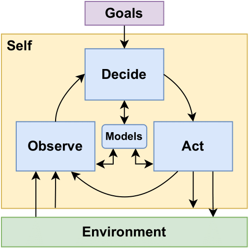
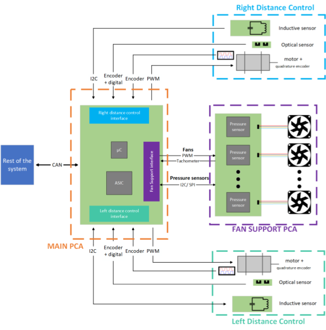
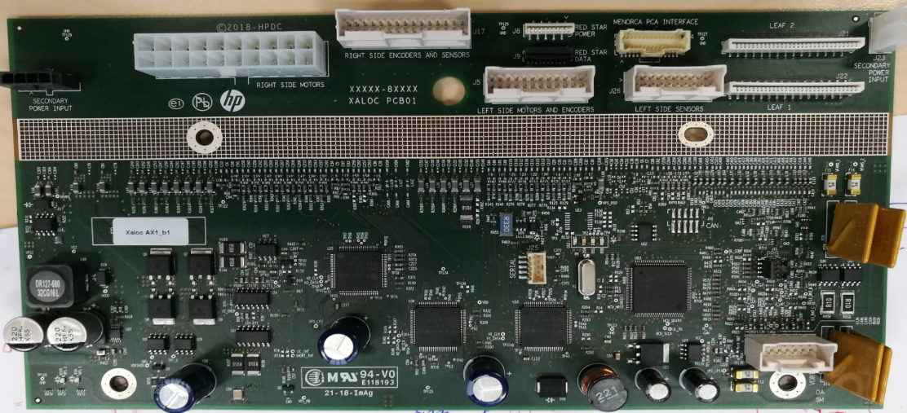
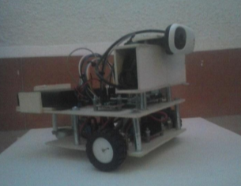

# Thesis & Dissertations

---
## Ph.D. Thesis

    <a target="_blank" rel="noopener noreferrer" href="http://dx.doi.org/10.5821/dissertation-2117-424246" title="PhD thesis">
        Bringing Self-Awareness to the Extreme Edge - A Distributed Approach for Adaptive Energy Management in WSNs Applied to Structural Health Monitoring
    </a>

__Brief Summary:__
This is my Ph.D. Thesis in Dynamic Energy Management (DEM) in wireless sensor nodes. Wireless sensor nodes in an IoT network are resource constrained devices, particularly regarding their limited battery life. DEM enables wireless sensor nodes to optimize their resource optimization by dynamically adjusting to their changing operating conditions. For example, if a sensor node is monitoring for wildfires the monitoring requires are not the same after a rainy day when the risk of fire is low, than during the summer season when the fire risk is high. Despite the success in DEM over the past few decades, most of the existing methods rely on simple static behaviors or only monitor a few parameters to guide their adaptive behavior. The work presented in this thesis, research the use of Self-Awareness to enable the implementation of more complex adaptive behaviors directly at the sensor node level. In this context, a device is considered to be self-aware if it's able to monitor itself and its environment, use this information to learn and maintain models in an ongoing basis, and use this information to make intelligent decisions at runtime based on its high-level operational goals.

<figure markdown="span">
  { width="300" }
  
Observe Decide Act (ODA) loop

</figure>

---
## M.Sc. Thesis

    <a target="_blank" rel="noopener noreferrer" href="https://upcommons.upc.edu/handle/2117/124315" title="Masters thesis">
        Design and integration of control electronics for distance and airflow management
    </a>

__Brief Summary:__
This is my M.Sc. Thesis I did as part the HP's R&D academy program. This thesis summarizes the work I did designing the control electronics for a distance control system and an airflow management module. In both cases my work consisted in the electronic schematic design (component selection, simulation work, circuit investigation, etc.), and the initial set of validation tests and integration with other components designed by other teams on a printer prototype. The designed PCBs integrated analog sensors, motor control stages, and an STM microcontroller. These PCBs are part of a larger system, thus integration with other modules through serial interfaces (UART, SPI, I2C) voltage rails, auto diagnostics, etc.

<figure markdown="span">
  { width="500" }
  
Block diagram of my M.Sc. project

</figure>

<figure markdown="span">
  { width="600" }
  
One of the designed PCBs M.Sc. project

</figure>

---
## B.Sc Final Project

    <a target="_blank" rel="noopener noreferrer" href="https://drive.google.com/file/d/170bi9dNDOwZmmE8zO6q15ySLHxuf0xw4/view?usp=drive_link" title="B.Sc">
        Development of a Vision Guided Autonomous Robot - Desarrollo de un robot autónomo guiado por visión
    </a>

__Brief Summary:__
This is my B.Sc. Thesis the document is only available in spanish. This document describes my work developing an autonomous robot based on a Raspberry Pi, which is able to navigate using a camera as its main sensor along with odometry sensors. The navigation algorithms is composed of two main parts. First, the obstacle avoidance subsystem based on color and edge detection on the camera stream. Second, the Visual Self Localization and Mapping (VSLAM) algorithm capable of identifying custom visual targets, generate a map and locate itself in that map.

<figure markdown="span">
  
  
Robot made as part of my B.Sc final project

</figure>